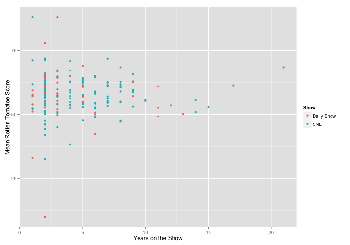

SNLvDS Shiny Package
========================================================
author: Nicholas Rose
date: November 20, 2015

Shiny Package Overview
========================================================

For more details on authoring R presentations click the
**Help** button on the toolbar.

- Bullet 1
- Bullet 2
- Bullet 3


Shiny Table Description
=======================================================
The table produced after selecting an actor ... example table

```r
summary(cars)
```

```
     speed           dist       
 Min.   : 4.0   Min.   :  2.00  
 1st Qu.:12.0   1st Qu.: 26.00  
 Median :15.0   Median : 36.00  
 Mean   :15.4   Mean   : 42.98  
 3rd Qu.:19.0   3rd Qu.: 56.00  
 Max.   :25.0   Max.   :120.00  
```

Shiny Plot Description
=======================================================
The plot produce from the data is
 

Application 
=======================================================
